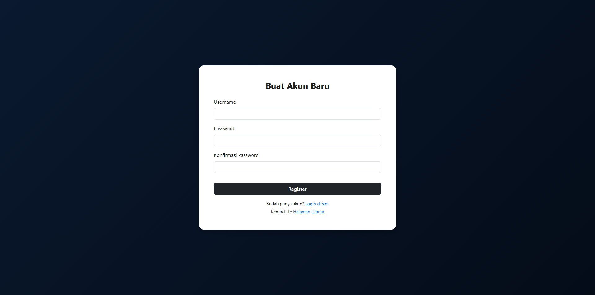
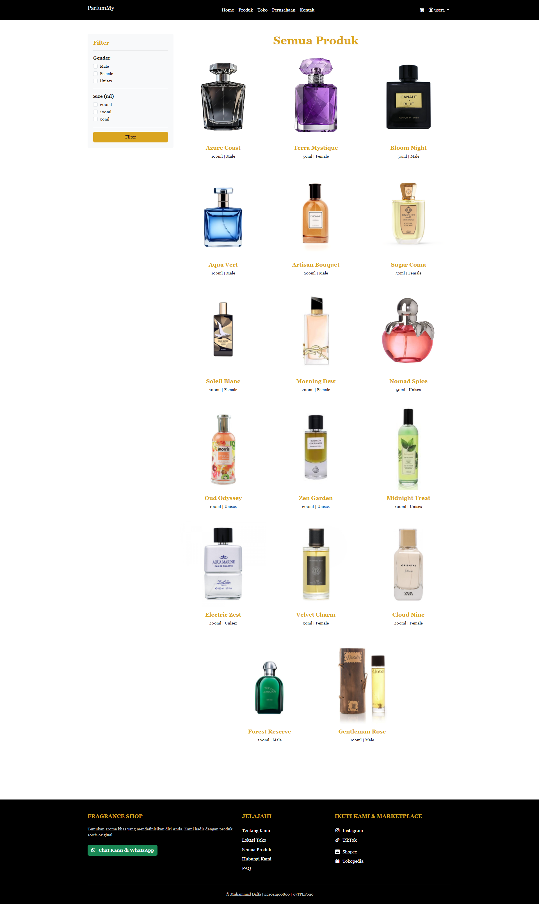
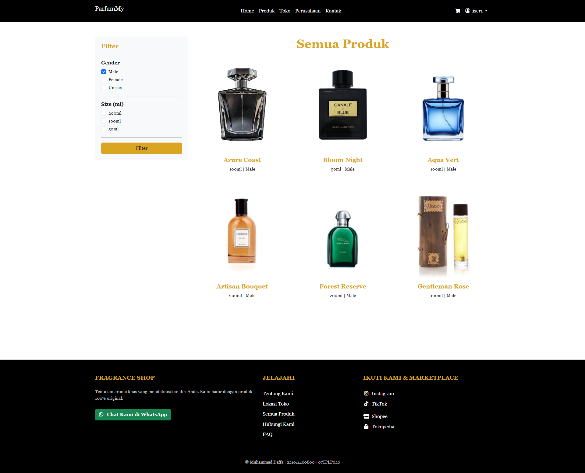
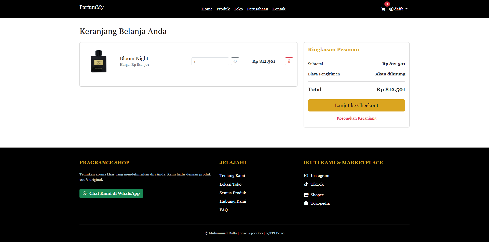
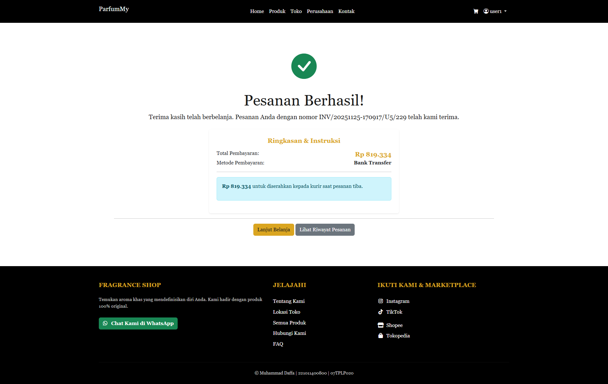
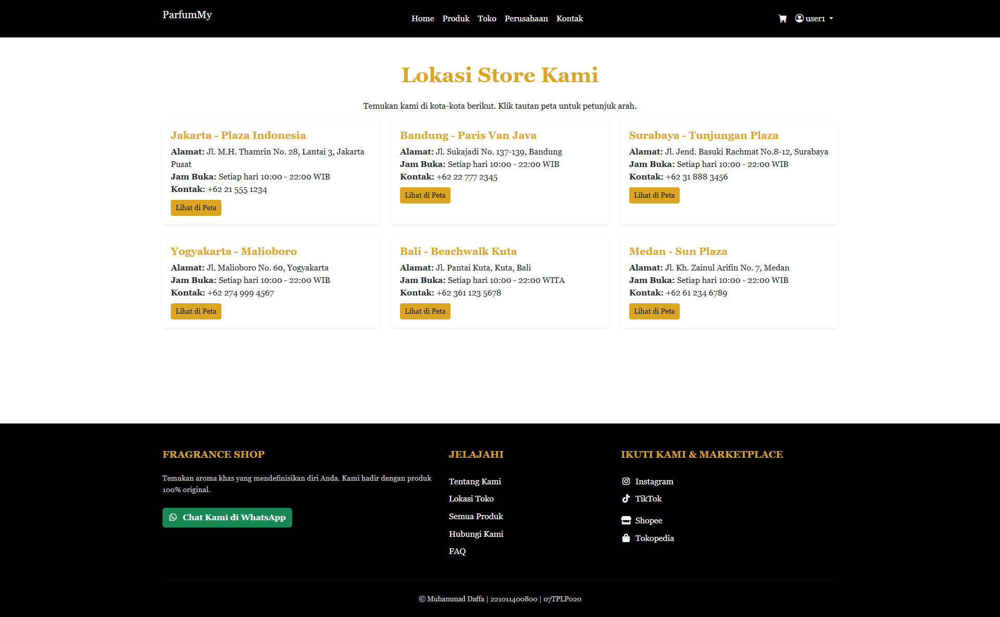
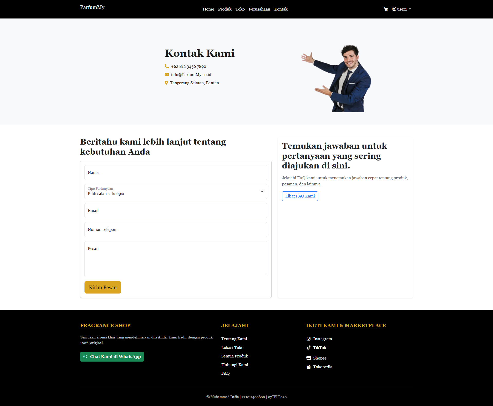
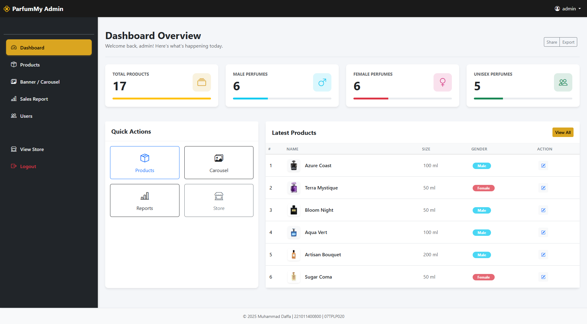

# Toko Parfum Online - Web Application

Aplikasi berbasis web untuk penjualan parfum secara online. Sistem ini mencakup fitur lengkap untuk **Pelanggan** (User) dan **Administrator** (Admin), mulai dari registrasi, transaksi pembelian, hingga laporan penjualan.

---

## 📋 Fitur Utama

### 👤 Halaman Pengguna (User)
1.  **Registrasi & Login**: Keamanan akses menggunakan akun pribadi.
2.  **Katalog Produk**: Menampilkan daftar parfum dengan harga dan deskripsi.
3.  **Keranjang Belanja (Cart)**: Menampung barang sebelum checkout.
4.  **Checkout & Pembayaran**: Proses pemesanan dan instruksi pembayaran.
5.  **Konfirmasi Pembayaran**: Upload bukti transfer via modal popup.
6.  **Riwayat Pesanan**: Memantau status pesanan (Pending, Menunggu Konfirmasi, Dikirim, Selesai).

### 🛠 Halaman Admin
1.  **Dashboard**: Ringkasan statistik toko.
2.  **Manajemen Produk**: Tambah, edit, dan hapus data parfum.
3.  **Konfirmasi Pesanan**: Verifikasi bukti pembayaran dari user.
4.  **Laporan Penjualan**: Rekapan detail transaksi yang berhasil.
5.  **Manajemen User**: Mengelola akun pengguna (Ban/Unban).

---

## 📸 Dokumentasi & Alur Aplikasi

Berikut adalah dokumentasi tampilan dan alur penggunaan aplikasi:

### 1. Login & Registrasi
User harus login terlebih dahulu untuk melakukan transaksi.
*(Pastikan user sudah terdaftar dan aktif)*

### 2. Katalog & Detail Produk
User dapat melihat berbagai koleksi parfum dan melihat detailnya sebelum membeli.

### 3. Keranjang & Checkout
Proses memasukkan barang ke keranjang dan melakukan checkout pesanan.

### 4. Proses Pembayaran & Upload Bukti
Setelah checkout, user melakukan transfer dan mengupload bukti pembayaran melalui fitur **Konfirmasi Pembayaran**.

### 5. Halaman Admin - Dashboard & Produk
Admin memantau aktivitas toko dan mengelola stok barang.

### 6. Admin - Verifikasi Pembayaran
Admin menerima notifikasi pesanan baru, mengecek bukti transfer, dan menyetujui pesanan.

### 7. Laporan Penjualan (Sales Report)
**[PENTING]** Admin memiliki fitur rekapan penjualan untuk melihat omzet dan detail produk yang terjual.

### 8. Manajemen User
Admin dapat melihat daftar user dan memblokir akses jika diperlukan.

---

## Teknologi yang Digunakan
*   **Bahasa Pemrograman**: PHP Native
*   **Database**: MySQL (MariaDB)
*   **Frontend**: HTML, CSS, Bootstrap 5
*   **Server**: Apache (XAMPP)

---

## Identitas Pengembang
*   **Nama**: Muhammad Daffa
*   **NIM**: 221011400800
*   **Kelas**: 07TPLP020

## admin
admin
123